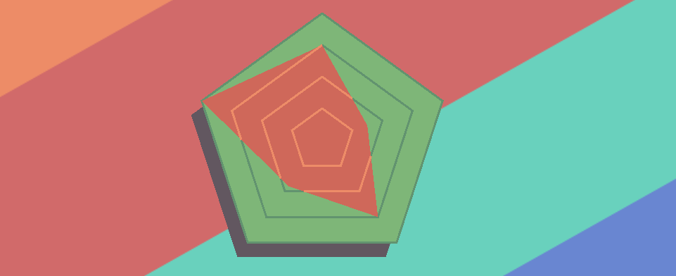
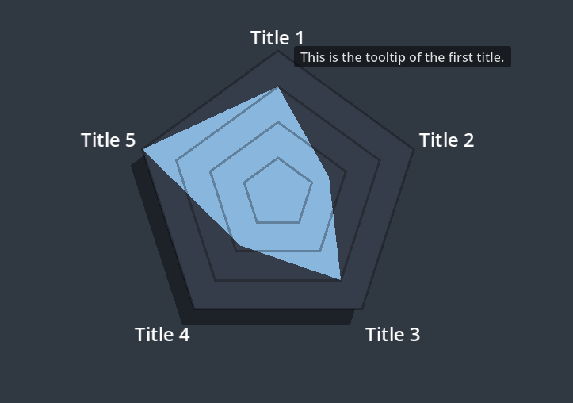
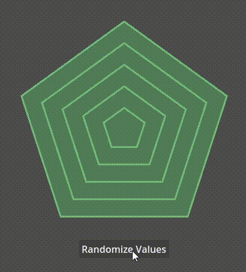

# Under construction
---

# Graph.gd (Formaly Godot Radar Graph)
---

A Godot addon that provides multiple graphs, which are highly customizable and extendable.

> [!NOTE]
> New with version 2! Added out of the box support for 3 types of graphs such as Bar, Line and Pie graphs. (Radar graphs are still included)

# Features

## Bar Graph
- [x] Basic implementation
- [x] Floating values
- [x] Stacked Bars
- [ ] Style Support
- [ ] Custom value functions such as exponential & log functions

## Line Graph
- [ ] Basic implementation
- [ ] Floating values
- [ ] Style Support
- [ ] Custom value functions such as exponential & log functions

## Pie Graph
- [ ] Basic implementation

## Misc.
- [ ] Patterns & shapes
- [ ] Ledgend
- [ ] Tooltips


- Godot Radar Graph is a script that allows you to easily draw [Radar Graphs](https://en.wikipedia.org/wiki/Radar_chart) which are highly [customizable](#customize) and also supports animation. See the [installation guide](#installation) to get started.
> [!NOTE]
> As of 1.1 the addon follows a normal addon structure so you can no longer reference this addon normally.
  ```gdscript
  # Extending Godot Radar Graph.
  extends "res://addons/godot_radar_graph/radar_graph.gd"

	# Rreferencing withing a script.
	const RadarGraph := preload("res://addons/godot_radar_graph/radar_graph.gd")

	# Example use.
	func foo(graph: RadarGraph) -> void:
		pass
  ```



> Replica of the icon created using custom drawing, check out [the code](addons/godot_radar_graph/demos/custom_drawing/icon_graph.gd).


# Installation
Download the files from the [Godot Asset Library](https://godotengine.org/asset-library/asset/3670) or download the latest release.

# Setting Up A Graph
1. Just search for `RadarGraph` while adding a node.
2. Setup the graph using is multitude of options.

# Customize
### Colors
  > [!IMPORTANT]
  > Due to **Godot's Theme** limitations all styling will have to be set using the exported properties.
  - The drawing can be highly customized, from using the ```draw_order``` array to overridding the existing ```_rg_graph_draw_``` functions.
  Checkout the [demos](addons/godot_radar_graph/demos/).
### Fonts
  > [!NOTE]
  > All fonts are different! Be sure to use reliable font's to ensure the script works correctly.
  - Note that fonts also decide the bounding box for it's corrosponding tooltip


> Customized using colors from the Godot Editor.

### Animation
  - All properties in the editor are keyable as well as Tween's. Although using `set(<property_name>)` is supported its still best to use the `set_item_` methods.


> Displaying randomizing the values using a Tween. Check out [the code](addons/godot_radar_graph/demos/animation/tween_example.gd).
